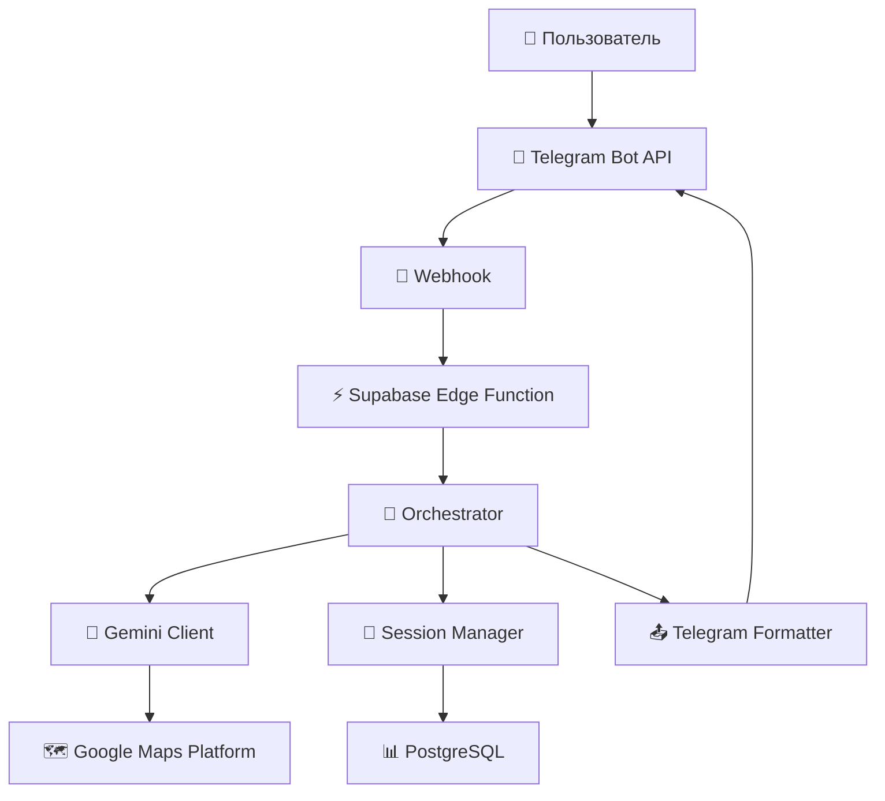

# 🤖 SpotFinder - AI-Powered Location Assistant

<div align="center">


**Интеллектуальный Telegram-бот для поиска мест с использованием естественного языка и AI**

[](https://www.typescriptlang.org/)
[](https://supabase.com/)
[](https://ai.google.dev/)
[](https://telegram.org/)

</div>

## 🎯 Что это такое?

SpotFinder - это революционный Telegram-бот, который понимает ваши потребности на естественном языке и мгновенно находит нужные места рядом с вами. Вместо навигации по категориям, просто опишите, что вам нужно:

- **"Промочил ноги"** → Обувные магазины
- **"Хочу поработать"** → Кафе с Wi-Fi и тихой атмосферой  
- **"У меня сел телефон"** → Места с розетками поблизости
- **"Срочно нужна аптека"** → Ближайшая открытая аптека

## ✨ Ключевые особенности

### 🧠 AI-понимание намерений
- Распознает неявные запросы и контекст
- Понимает естественный русский язык
- Обрабатывает опечатки и сокращения

### 💬 Контекстные диалоги
- Задавайте уточняющие вопросы: *"А у второго есть парковка?"*
- Сравнивайте варианты: *"Что дешевле - первый или второй?"*
- Получайте детальную информацию о местах

### 📍 Умная геолокация
- Автоматическое определение вашего местоположения
- Поиск в радиусе до 5 км
- Учет актуальности локации (TTL 20 минут)

### 🎨 Интуитивный интерфейс
- Inline кнопки для быстрых действий
- Интеграция с Google Maps
- Построение маршрутов одной кнопкой

## 🏗️ Архитектура



### Технологический стек

- **Backend**: Supabase Edge Functions (Deno + TypeScript)
- **Database**: PostgreSQL 15 с PostGIS расширением
- **AI**: Google Gemini Pro с Maps Grounding
- **Maps**: Google Maps Platform (Places API)
- **Messaging**: Telegram Bot API
- **Cache**: PostgreSQL таблицы для сессий и кэша

## 🚨 Исправление 401 ошибки

**Если ваш бот получает 401 ошибки** - это из-за неправильного URL формата webhook!

👉 **[СРОЧНОЕ ИСПРАВЛЕНИЕ за 5 минут](FIX_401_NOW.md)** 👈

Используйте правильный URL:
- ✅ `https://PROJECT.functions.supabase.co/telegram-webhook`
- ❌ `https://PROJECT.supabase.co/functions/v1/telegram-webhook` (вызывает 401!)

📖 [Полная документация по webhook](Docs/WEBHOOK_SETUP.md)

---

## 🚀 Быстрый старт

### Предварительные требования

- ✅ Аккаунт Supabase
- ✅ Telegram Bot Token (от [@BotFather](https://t.me/BotFather))
- ✅ Google API ключи (Gemini + Maps)

### 1. Клонирование репозитория

```bash
git clone https://github.com/your-username/spotfinder.git
cd spotfinder
```

### 2. Настройка переменных окружения

**Windows PowerShell:**
```powershell
$env:TELEGRAM_BOT_TOKEN = "your_telegram_token"
$env:GEMINI_API_KEY = "your_gemini_key"
$env:GOOGLE_MAPS_API_KEY = "your_google_maps_key"
$env:SUPABASE_URL = "https://your-project.supabase.co"
$env:SUPABASE_SERVICE_ROLE_KEY = "your_service_role_key"
```

**Linux/macOS:**
```bash
export TELEGRAM_BOT_TOKEN="your_telegram_token"
export GEMINI_API_KEY="your_gemini_key"
export GOOGLE_MAPS_API_KEY="your_google_maps_key"
export SUPABASE_URL="https://your-project.supabase.co"
export SUPABASE_SERVICE_ROLE_KEY="your_service_role_key"
```

### 3. Настройка Supabase

1. Создайте новый проект на [supabase.com](https://supabase.com)
2. Примените миграции из `supabase/migrations/` в SQL Editor
3. Установите secrets:

```bash
supabase secrets set TELEGRAM_BOT_TOKEN="your_token"
supabase secrets set GEMINI_API_KEY="your_key"
supabase secrets set GOOGLE_MAPS_API_KEY="your_key"
supabase secrets set SUPABASE_URL="https://your-project.supabase.co"
supabase secrets set SUPABASE_SERVICE_ROLE_KEY="your_service_role_key"
```

### 4. Развертывание

```bash
# Установка Supabase CLI
npm install -g supabase

# Логин в Supabase
supabase login

# Связывание с проектом
supabase link --project-ref your-project-id

# Развертывание функций
supabase functions deploy telegram-webhook
```

### 5. Настройка webhook

```bash
# Используйте скрипт для автоматической настройки
./scripts/setup-webhook.sh
```

> 📚 **Подробные инструкции:** См. [docs/DEPLOYMENT.md](docs/deployment/DEPLOYMENT.md) для полного руководства по развертыванию

## 📚 Документация

Вся документация проекта организована в папке `docs/`:

- 📖 **[docs/README.md](docs/README.md)** - Индекс всей документации
- 🚀 **[docs/QUICKSTART.md](docs/QUICKSTART.md)** - Быстрый старт
- 🏗️ **[docs/Architecture.md](docs/Architecture.md)** - Техническая архитектура
- 📋 **[docs/PRD.md](docs/PRD.md)** - Product Requirements Document
- 🔒 **[docs/SECURITY.md](docs/security/SECURITY.md)** - Безопасность
- 🚀 **[docs/DEPLOYMENT.md](docs/deployment/DEPLOYMENT.md)** - Развертывание
- 🧪 **[docs/TESTING.md](docs/development/TESTING.md)** - Тестирование

### Структура документации

```
docs/
├── 📁 deployment/          # Развертывание и миграции
├── 📁 development/         # Разработка и тестирование  
├── 📁 security/           # Безопасность
├── 📁 scripts/            # Скрипты и утилиты
└── 📄 *.md               # Основная документация
```

## 📖 Использование

### Команды бота

| Команда | Описание |
|---------|----------|
| `/start` | Начать работу, запросить геолокацию |
| `/help` | Справка по использованию |
| `/location` | Обновить геолокацию |
| `/donate` | Поддержать проект |

### Примеры запросов

**Базовые поиски:**
- "Найди кофейню"
- "Где ближайшая аптека?"
- "Покажи рестораны"

**Контекстные запросы:**
- "Промочил ноги" → обувные магазины
- "Хочу поработать" → кафе с Wi-Fi
- "Сел телефон" → места с розетками
- "Заболел" → аптеки

**Уточняющие вопросы:**
- "А у второго есть парковка?"
- "Какой у первого рейтинг?"
- "Далеко ли третий?"

## 🔒 Безопасность

**⚠️ ВАЖНО:** Этот проект содержит чувствительные данные. Перед началом работы обязательно прочитайте [SECURITY.md](SECURITY.md).

### Основные принципы безопасности:

- 🔐 Все API ключи хранятся в переменных окружения
- 🚫 Никогда не коммитьте файлы с реальными ключами
- 🔄 Регулярно ротируйте Service Role Key
- 📝 Используйте файлы-примеры (.example) для настройки

## 📊 Мониторинг и аналитика

### Ключевые метрики

- **Accuracy**: 80%+ понимания запросов
- **Response Time**: <5 секунд для 90% запросов
- **Success Rate**: 75%+ успешных поисков
- **Follow-up Rate**: 30%+ уточняющих вопросов

### Логирование

Все критические операции логируются:
- Входящие запросы пользователей
- AI-запросы к Gemini API
- Ошибки и исключения
- Производительность запросов

## 🧪 Тестирование

```bash
# Запуск тестов
npm test

# Тестирование функций Supabase
supabase functions serve --env-file .env.local
```

### Покрытие тестами

- ✅ Unit тесты для core логики
- ✅ Integration тесты для API
- ✅ Mock тесты для внешних сервисов
- ✅ E2E тесты для пользовательских сценариев

## 📁 Структура проекта

```
spotfinder/
├── 📁 docs/                    # 📚 Вся документация
│   ├── 📁 deployment/          # Развертывание и миграции
│   ├── 📁 development/         # Разработка и тестирование  
│   ├── 📁 security/           # Безопасность
│   ├── 📁 scripts/            # Скрипты и утилиты
│   └── 📄 *.md               # Основная документация
├── 📁 supabase/
│   ├── 📁 functions/
│   │   ├── 📁 _shared/          # Общие модули
│   │   │   ├── orchestrator.ts  # Основная логика
│   │   │   ├── session-manager.ts # Управление сессиями
│   │   │   ├── gemini-client.ts # AI клиент
│   │   │   └── telegram-client.ts # Telegram API
│   │   └── 📁 telegram-webhook/ # Webhook endpoint
│   └── 📁 migrations/           # SQL миграции
├── 📁 scripts/                  # Скрипты развертывания
├── 📄 README.md                 # Этот файл
└── 📄 package.json              # Зависимости проекта
```

## 🤝 Вклад в проект

Мы приветствуем вклад в развитие SpotFinder! Пожалуйста, ознакомьтесь с [docs/development/CONTRIBUTING.md](docs/development/CONTRIBUTING.md) для получения подробной информации.

### Как помочь:

1. 🐛 Сообщайте об ошибках через Issues
2. 💡 Предлагайте новые функции
3. 📝 Улучшайте документацию
4. 🔧 Исправляйте баги и добавляйте тесты

## 📈 Roadmap

### ✅ v1.0 - MVP (Завершено)
- Базовый поиск по естественному языку
- Контекстные диалоги
- Управление геолокацией

### 🚧 v1.1 - Оптимизация (В разработке)
- Unit и Integration тесты
- Улучшенное кэширование
- Analytics dashboard
- Performance optimization

### 🔮 v2.0 - Расширение (Планируется)
- Бронирование столиков
- Интеграция с такси
- Premium подписка
- Мультиязычность

## 📄 Лицензия

Этот проект лицензирован под MIT License - см. файл [LICENSE](LICENSE) для деталей.

## 📞 Поддержка

- 📧 Email: pokrovskiy.v@gmail.com
- 💬 Telegram: [@v_pokrovskiy](https://t.me/v_pokrovskiy)

## 🙏 Благодарности

- Google за Gemini API и Maps Platform
- Supabase за отличную платформу
- Telegram за Bot API

---

<div align="center">

**Сделано Vitaliy Pokrovskiy**

</div>